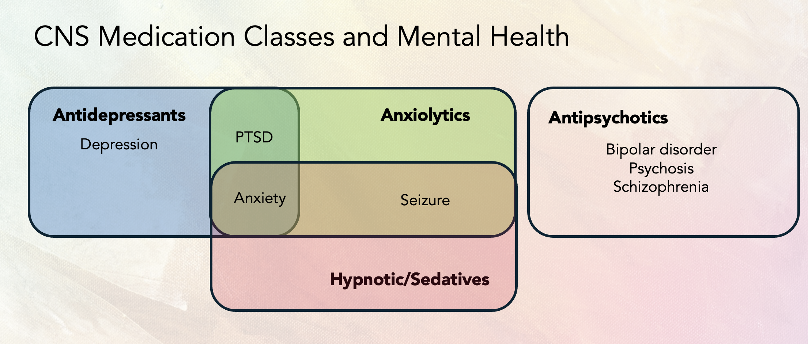

# Methodology
This page explains our project methodology in depth. It can mostly be split into 6 sections (EDA, Base Cohort Creation, Flagging/Indicator Tables, Prevalence/Statistic Analysis, and Predictive Modeling, and Explanatory Modeling).

---

## 1. Performing Initial EDA
The first few weeks of the study involved familiarizing with the OMOP Common Data Model and gaining access credentials to the Pharmetrix+ Database. After that, we extracted stroke patients who:
* Were hospitalized with stroke.
* Had another stroke within 180 days.
* Were under observation 6 months before and after.
* Developed any communication symptoms and can be classified by discharge status (speech disorder issues must occur
across multiple days)

The parameters we used for this cohort (and our base aphasia cohort) were built upon a previous project done by another group whose work can be found [here](https://github.com/cbt87/stroke_aftercare). It should be noted that this other study focused on aphasia, dysphagia, and dysarrthria, but our project focused mainly on aphasia.

<p align="center">
    
</p><br>

Next we performed initial exploratory data analysis to get a sense of the stroke cohort in general (about 67,000 patients). We observed things ranging from distributions of age (see below example), gender differences, and time trends, all of which can be viewed in our GitHub Repository.

<p align="center">
    
</p><br>

For key observations and a more detailed interpretation of our intial EDA results, please refer to the Key Takeaways section found [here](./key-takeaways#initial-eda-takeaways).

---

## 2. Creating the Base Aphasia Cohort
From the broader stroke cohort, the next thing we did was flag patients for aphasia based on the following conditions:
* Concept IDs 440424 and 40480002
* At least 2 occurrences with at least 1 of those being after a stroke event.
* We also removed many with dementia events that could potentially cause confounding

Taking the previous stroke cohort requirements in account, this amounted to a total of 8265 aphasia patients in our cohort.

---

## 3. Creating Flagging Tables
We expanded the base cohort by creating flagging/indicator tables with binary columns indicating whether patients met specific conditions (mental health, PIMs, polypharmacy, or high-risk criteria). All tables and CSVs can be automatically generated and saved using the advised Makefile commands in our GitHub repository.

### Mental Health Conditions Table
* This table expands the base cohort by adding binary indicators that flag whether or not the patient has experienced any of seven mental health categories (see conditions below). Ancestor concept IDs were used to capture all descendant diagnoses within the observation period. There is also a combined flag for any mental health condition.
* The table also includes a `condition_names` column, which lists the exact descendant concepts recorded for each patient, allowing both high-level category analysis and detailed condition-level review.
    ```bash
    mental_health_conditions = {
        377091: "Seizure",
        440383: "Depression",
        442077: "Anxiety",
        436665: "Bipolar",
        435783: "Schizophrenia",
        436676: "PTSD",
        436073: "Psychotic Disorder"
    }
    ```

### Potentially Inappropriate Medications (PIM) Table
* Similar to the mental health table, this PIM table has binary columns that indicate whether a patient was exposed to any PIM within each ATC drug class (antidepressants, anxiolytics, antipsychotics, hypnotics/sedatives). This table also incudes polypharmacy flags (5+ meds taken concurrently for 30+ days) for either all medications or just PIMs. Only oral (PO) PIMs within the observation period from the doctor-provided list were counted. We also tracked `first_pim_date`, `last_pim_date`, and `total drug_count` for PIM exposures.

### High-Risk Table <a id="high-risk-methodology"></a>
* We then flagged patients for risk based on CNS Medication Classes and Mental Health (see chart below). For example, a patient taking antidepressants without a corresponding diagnosis for depression, PTSD, or anxiety would be flagged for antidepressant PIM risk.

<p align="center">
    
</p><br>

*  A `total_risk_score` combined the four main risk flags plus the `has_polypharmacy` flag (maximum = 5). Patients with a score ≥2 were flagged as high_risk (~1,000 patients). Score distribution (0–5) was also tracked to support future analyses and statistical testing.

### Filtering and Merging
* In preparation for statistical analysis, we merged and mapped all of our tables to prepare for in-depth analysis. The dataset with a total of 53,068 post-stroke patients (flagged for multiple conditions)

---

## 4. Prevalence/Statistical Analysis
Using all of our cohort and flagging tables, we performed statistical analysis to compare mental health comorbidities, PIM use, and medication-diagnosis discordance patterns (high risk patterns) between patients with and without aphasia. Our final merged dataset included 53,068 post-stroke patients (8,265 with aphasia, 44,803 without).

We examined prevalence rates for all seven mental health conditions and four PIM categories, along with burden metrics such as the total number of conditions or PIMs per patient. We also analyzed the medication-diagnosis discordance patterns captured by our risk flags and investigated how these factors related to high-risk classification. 
* Chi-square tests were used to compare categorical outcomes (prevalence rates, distribution patterns)
* Independent t-tests were used for continuous measures (mean counts, burden scores).
* Pearson correlations were used to examine associations between aphasia status and adverse outcomes, as well as relationships between different risk factors. 
* All tests used a significance level of α = 0.05.

To investigate potential diagnostic gaps, we performed stratified analyses that separately examined patients with documented mental health conditions versus those without. This approach revealed whether medication-diagnosis discordance patterns differed between subgroups. Something particularly important for understanding whether aphasia patients might be receiving psychotropic medications without formal psychiatric evaluation.

We also developed an interactive cohort exploration tool that allows dynamic filtering by multiple health conditions and medication patterns, enabling users to examine how aphasia prevalence varies across different patient subgroups. You can find that [here](./cohort-explorer).

---

## 5. Predictive Modeling: Readmission Risk Prediction
Three predictive models were developed using an 80/20 train-test split with stratified sampling to predict 180-day hospital readmissions in stroke survivors with PIM prescriptions. The models incorporated 36 features including medication burden metrics, mental health comorbidities, medication-diagnosis discordance flags, and engineered interaction terms. Performance was evaluated using AUROC and AUPRC metrics with SHAP values used to interpret XGBoost feature importance.
* **Model 1:** Logistic Regression
* **Model 2:** Lasso Logistic Regression
* **Model 3:** XGBoost (with SHAP to interpret feature importance)

Additionally, multivariable logistic regression models were fitted to examine independent effects of aphasia after controlling for confounding variables.
* **Model 1:** PIM Use as outcome
* **Model 2:** High-risk Status as outcome
* **Model 3:** 180-day Readmission as outcome

---

## 6. Explanatory Modeling: Clinical Impact Analysis <a id="explanatory-modeling-methodology"></a>
Building on the predictive modeling work, this analysis addressed extra questions raised about PIM impact in clinically interpretable terms:
1. Are patients with PIMs more likely to experience hospital readmissions than those without, and does this relationship differ between aphasia and non-aphasia groups?
2. What are the predicted probabilities of 180-day readmission for all aphasia/PIM combinations?
3. How many expected readmission events per 1,000 patients does PIM exposure contribute?
4. How much of the readmission disparity between aphasia and non-aphasia groups can be attributed to differential PIM prescription rates versus differential response to PIMs?

A logistic regression model was developed using the full post-stroke cohort (N=53,068) to quantify the association between PIM exposure and 180-day readmissions. The model included aphasia status, PIM exposure, and seven mental health comorbidities as covariates. An interaction term (aphasia × PIM) was tested but removed due to non-significance (p > 0.95).A high-risk subset (N=16,971 with PIMs) was initially analyzed, but we expanded to the full cohort to avoid selection bias from PIM-related filtering criteria.

**Statistical methods:**
* L1 regularization (α = 0.01) to handle quasi-separation
* Bootstrap confidence intervals (1,000 iterations) for predicted probabilities
* G-computation for marginal effects decomposition

The analysis produced predicted probabilities of readmission for all aphasia/PIM combinations, translated these into expected events per 1,000 patients, and decomposed readmission disparities by their contributing factors.
