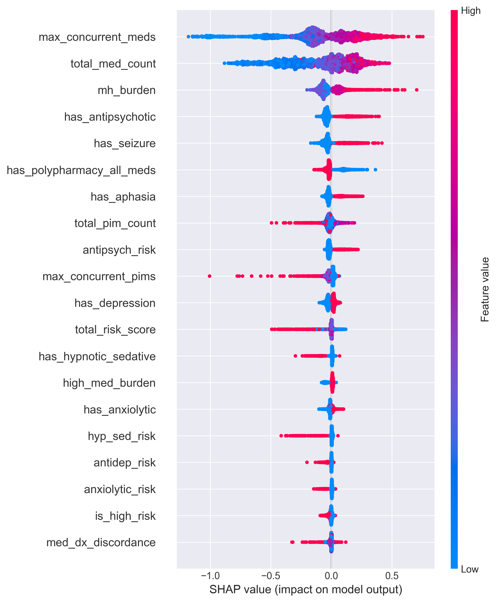
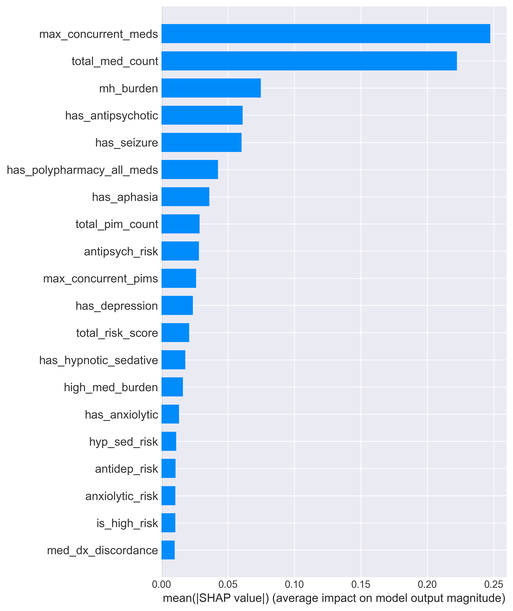
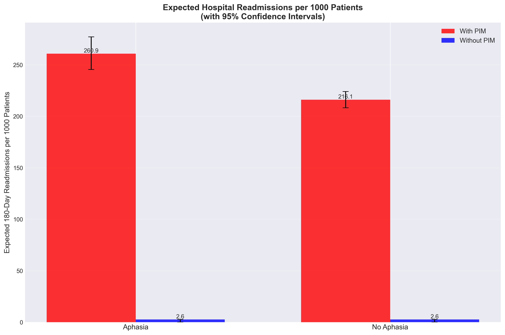

# Visualizations
This page contains various graphs and visualizations associated with our results reports created throughout the in-depth analysis. You will find that the statistics/modeling reports all have links to the specified visualizations on this page. For any prevalence or specified cohort visuals, please refer to the [Interactive Cohort Explorer](./cohort-explorer).

---

```js
const data = await FileAttachment("high_risk_cohort_no_dementia.csv").csv({typed: true});
```

## Statistics Report Visualizations
<br>

### Mental Health Burden Distribution <a id="mh-burden-distribution-graph"></a>
*Hover over each bar to get full information.*

```js
const mhBurdenData = data.map(d => {
  const numConditions = [
    d.has_depression,
    d.has_anxiety,
    d.has_bipolar,
    d.has_schizophrenia,
    d.has_ptsd,
    d.has_psychotic_disorder,
    d.has_seizure
  ].filter(val => val === 1).length;
  
  return {
    has_aphasia: d.has_aphasia,
    num_conditions: numConditions
  };
});

const mhBurdenByAphasia = d3.rollups(
  mhBurdenData,
  v => v.length,
  d => d.num_conditions,
  d => d.has_aphasia
).flatMap(([numConditions, aphasiaGroups]) => 
  aphasiaGroups.map(([hasAphasia, count]) => ({
    num_conditions: numConditions,
    group: hasAphasia === 1 ? 'With Aphasia' : 'Without Aphasia',
    count
  }))
).sort((a, b) => a.num_conditions - b.num_conditions);

// Calculate totals for percentages
const mhTotals = d3.rollup(
  mhBurdenByAphasia,
  v => d3.sum(v, d => d.count),
  d => d.group
);
```

```js
Plot.plot({
  caption: "Distribution of Mental Health Condition Burden by Aphasia Status",
  marginLeft: 60,
  height: 300,
  x: { 
    label: "Number of Mental Health Conditions",
    domain: [0, 1, 2, 3, 4, 5, 6, 7]
  },
  y: { label: "Percent of Group" },
  color: {
    domain: ['With Aphasia', 'Without Aphasia'],
    range: ['#ff7f0e', '#1f77b4'],
    legend: true
  },
  marks: [
    Plot.barY(mhBurdenByAphasia, {
      x: "num_conditions",
      y: d => (d.count / mhTotals.get(d.group)) * 100,
      fill: "group",
      order: ['With Aphasia', 'Without Aphasia'],  // Add this line
      tip: true,
      channels: {
        "# Conditions": d => d.num_conditions,
        Percent: d => `${((d.count / mhTotals.get(d.group)) * 100).toFixed(2)}%`,
        Count: d => d.count.toLocaleString()
      }
    }),
    Plot.ruleY([0])
  ]
})
```
Non-aphasia patients have higher within-population prevalence among those with no mental health conditions. However, as soon as the cohort has at least 1 mental health condition, aphasia patients have higher within-population prevalence.

<br>

### PIM Burden Distribution <a id="pim-burden-distribution-graph"></a>
*Hover over each bar to get full information.*
```js
// num PIMs per pt using atc class types
const pimBurdenData = data.map(d => {
  const pim_count = [
    d.has_antidepressant,
    d.has_anxiolytic,
    d.has_antipsychotic,
    d.has_hypnotic_sedative
  ].filter(val => val === 1).length;
  
  return {
    has_aphasia: d.has_aphasia,
    pim_count: pim_count
  };
});
const pimBurdenByAphasia = d3.rollups(
  pimBurdenData,
  v => v.length,
  d => d.pim_count >= 4 ? 4 : d.pim_count,  // group 4+ together
  d => d.has_aphasia
).flatMap(([numPims, aphasiaGroups]) => 
  aphasiaGroups.map(([hasAphasia, count]) => ({
    num_pims: numPims,
    group: hasAphasia === 1 ? 'With Aphasia' : 'Without Aphasia',
    count
  }))
).sort((a, b) => a.num_pims - b.num_pims);
const pimTotals = d3.rollup(
  pimBurdenByAphasia,
  v => d3.sum(v, d => d.count),
  d => d.group
);
```
```js
Plot.plot({
  caption: "Distribution of PIM Burden by Aphasia Status",
  marginLeft: 60,
  height: 300,
  x: { 
    label: "Number of PIMs",
    domain: [0, 1, 2, 3, 4],
    tickFormat: d => d === 4 ? "4+" : d
  },
  y: { label: "Percent of Group" },
  color: {
    domain: ['With Aphasia', 'Without Aphasia'],
    range: ['#ff7f0e', '#1f77b4'],
    legend: true
  },
  marks: [
    Plot.barY(pimBurdenByAphasia, {
      x: "num_pims",
      y: d => (d.count / pimTotals.get(d.group)) * 100,
      fill: "group",
      order: ['With Aphasia', 'Without Aphasia'],
      tip: true,
      channels: {
        "# PIMs": d => d.num_pims === 4 ? "4+" : d.num_pims,
        Percent: d => `${((d.count / pimTotals.get(d.group)) * 100).toFixed(2)}%`,
        Count: d => d.count.toLocaleString()
      }
    }),
    Plot.ruleY([0])
  ]
})
```

<br>

### Risk Score Distribution <a id="risk-score-distribution-graph"></a>
*Hover over each bar to get full information.*

```js
const riskTotals = d3.rollup(
  riskScoresByAphasia,
  v => d3.sum(v, d => d.count),
  d => d.group
);
```
```js
const riskScoresByAphasia = d3.rollups(
  data,
  v => v.length,
  d => d.total_risk_score,
  d => d.has_aphasia
).flatMap(([score, aphasiaGroups]) => 
  aphasiaGroups.map(([hasAphasia, count]) => ({
    score: score ?? 0,
    group: hasAphasia === 1 ? 'With Aphasia' : 'Without Aphasia',
    count
  }))
).sort((a, b) => a.score - b.score);
```
```js
Plot.plot({
  caption: "Distribution of Total Risk Scores by Aphasia Status",
  marginLeft: 60,
  height: 300,
  x: { 
    label: "Risk Score",
    domain: [0, 1, 2, 3, 4, 5]
  },
  y: { label: "Percent of Group" },
  color: {
    domain: ['With Aphasia', 'Without Aphasia'],
    range: ['#ff7f0e', '#1f77b4'],
    legend: true
  },
  marks: [
    Plot.barY(riskScoresByAphasia, {
      x: "score",
      y: d => (d.count / riskTotals.get(d.group)) * 100,
      fill: "group",
      order: ['With Aphasia', 'Without Aphasia'],  // order consistentcy
      tip: true,
      channels: {
        "Risk Score": d => d.score,
        Percent: d => `${((d.count / riskTotals.get(d.group)) * 100).toFixed(2)}%`,
        Count: d => d.count.toLocaleString()
      }
    }),
    Plot.ruleY([0])
  ]
})
```

<br>

---

## Predictive Modeling Visualizations
<br>

### ROC Curve Model Comparison

<p align="center">
    
    <a id="roc-curve-graph"></a>
</p><br>

<br>

### Top 15 Predictors (Logistic Regression) <a id="lr-odds-ratios-graph"></a>
*Red line: OR=1 (no effect)*
```js
const predictorsData = [
  {rank: 1, feature: "aphasia_x_polypharm", OR: 1.62},
  {rank: 2, feature: "has_anxiety", OR: 1.45},
  {rank: 3, feature: "has_any_discordance", OR: 1.38},
  {rank: 4, feature: "hyp_sed_risk", OR: 1.35},
  {rank: 5, feature: "has_polypharmacy_all_meds", OR: 1.31},
  {rank: 6, feature: "anxiolytic_risk", OR: 1.28},
  {rank: 7, feature: "has_seizure", OR: 1.24},
  {rank: 8, feature: "mh_burden", OR: 1.22},
  {rank: 9, feature: "has_any_mental_health_condition", OR: 1.18},
  {rank: 10, feature: "has_schizophrenia", OR: 1.16},
  {rank: 11, feature: "has_ptsd", OR: 1.15},
  {rank: 12, feature: "has_bipolar", OR: 1.12},
  {rank: 13, feature: "has_depression", OR: 1.10},
  {rank: 14, feature: "has_aphasia", OR: 1.08},
  {rank: 15, feature: "total_med_count", OR: 1.05}
];
```
```js
Plot.plot({
  width: 850,
  height: 800,
  marginLeft: 250,
  marginBottom: 80,
  insetLeft: 10,
  insetRight: 10,
  style: {
    fontSize: "15px",
    overflow: "visible"
  },
  y: {
    label: null,
    type: "band",
    padding: 0.6,
    tickSize: 0
  },
  x: {
    label: "Odds Ratio"
  },
  marks: [
    // Bars
    Plot.barX(predictorsData, {
      x: "OR",
      y: "feature",
      sort: { y: "x", reverse: true },
      fill: "#1f77b4"
    }),

    // OR value labels
    Plot.text(predictorsData, {
      x: "OR",
      y: "feature",
      text: d => d.OR.toFixed(2),
      dx: 6,
      dy: 3,
      textAnchor: "start",
      fontSize: 14,
      fill: "black"
    }),

    // OR = 1 reference line
    Plot.ruleX([1], {
      stroke: "red",
      strokeDasharray: "4,4",
      strokeWidth: 2
    })
  ]
})
```

<br>

### SHAP Values
<p align="center">
    
    <a id="shap-graph"></a>
</p><br>

<br>

### Mean SHAP Values
<p align="center">
    
    <a id="mean-shap-graph"></a>
</p><br>

<b4>

---

## Explanatory Modeling Visualizations
<br>

### Observed Readmission Rates <a id="observed-readmission-rates-graph"></a>
*Hover over each bar to get full information.*

```js
const readmissionData = [
  {group: 'Without Aphasia', rate: 7.50, pim_rate: 31.48, n: 44803},
  {group: 'With Aphasia', rate: 10.48, pim_rate: 34.71, n: 8265}
];
```
```js
const metricInput = Inputs.radio(
  ["Readmission Rate (%)", "PIM Prescription Rate (%)"],
  {label: "Metric to Display", value: "Readmission Rate (%)"}
);
const selectedMetric = Generators.input(metricInput);
view(metricInput);
```
```js
Plot.plot({
  width: 600,
  height: 400,
  marginBottom: 60,
  x: {label: null},
  y: {
    label: selectedMetric,
    grid: true,
    domain: [0, selectedMetric === "Readmission Rate (%)" ? 15 : 40]
  },
  color: {
    domain: ['Without Aphasia', 'With Aphasia'],
    range: ['#1f77b4', '#ff7f0e']
  },
  marks: [
    Plot.barY(readmissionData, {
      x: "group",
      y: selectedMetric === "Readmission Rate (%)" ? "rate" : "pim_rate",
      fill: "group",
      tip: true,
      title: d => selectedMetric === "Readmission Rate (%)" 
        ? `${d.group}\nReadmission Rate: ${d.rate.toFixed(2)}%\nN = ${d.n.toLocaleString()}`
        : `${d.group}\nPIM Prescription Rate: ${d.pim_rate.toFixed(2)}%\nN = ${d.n.toLocaleString()}`
    }),
    Plot.text(readmissionData, {
      x: "group",
      y: selectedMetric === "Readmission Rate (%)" ? "rate" : "pim_rate",
      text: d => selectedMetric === "Readmission Rate (%)" 
        ? `${d.rate.toFixed(2)}%`
        : `${d.pim_rate.toFixed(2)}%`,
      dy: -10,
      fill: "black",
      fontSize: 14,
      fontWeight: "bold"
    })
  ]
})
```

<br>

### Forest Plot for Odds Ratios <a id="forest-plot"></a>
*Make sure to hover over each section to get the full information.*

This is a forest plot of odds ratios (ORs) predicting 180-day readmissions. The points show estimated ORs with 95% CIs. Values above 1.0 indicate increased risk. Red = key variables; asterisks = significance.

The extreme odds ratio for PIM Exposure (289,059) makes it difficult to visualize the other predictors on a standard scale, so you can toggle the display mode to look at either the log scale (with all predictors), the log scale excluding PIM (clearer comparison), or linear scale (compressed).

```js
const orData = [
  {variable: 'PIM Exposure', or: 289059, ci_lower: 7.4, ci_upper: 1.13e10, p_value: 0.020, sig: '*', is_key: true},
  {variable: 'Psychotic Disorder', or: 2.02, ci_lower: 1.60, ci_upper: 2.56, p_value: 0.000, sig: '***', is_key: false},
  {variable: 'Seizure Disorder', or: 1.90, ci_lower: 1.74, ci_upper: 2.07, p_value: 0.000, sig: '***', is_key: false},
  {variable: 'Depression', or: 1.43, ci_lower: 1.33, ci_upper: 1.54, p_value: 0.000, sig: '***', is_key: false},
  {variable: 'Bipolar Disorder', or: 1.41, ci_lower: 1.19, ci_upper: 1.67, p_value: 0.000, sig: '***', is_key: false},
  {variable: 'Aphasia', or: 1.29, ci_lower: 1.17, ci_upper: 1.41, p_value: 0.000, sig: '***', is_key: true},
  {variable: 'Anxiety', or: 1.12, ci_lower: 1.04, ci_upper: 1.21, p_value: 0.002, sig: '**', is_key: false},
  {variable: 'PTSD', or: 0.97, ci_lower: 0.78, ci_upper: 1.21, p_value: 0.796, sig: '', is_key: false},
  {variable: 'Schizophrenia', or: 0.81, ci_lower: 0.55, ci_upper: 1.20, p_value: 0.292, sig: '', is_key: false}
];
```
```js
const scaleInput = Inputs.radio(
  ["Log Scale (Exclude PIM)", "Log Scale", "Linear Scale"],
  {label: "Y-Axis Scale", value: "Log Scale"}
);
const selectedScale = Generators.input(scaleInput);
view(scaleInput);
```
```js
const filteredORData = selectedScale === "Log Scale (Exclude PIM)" 
  ? orData.filter(d => d.variable !== 'PIM Exposure')
  : orData;

const useLogScale = selectedScale !== "Linear Scale";
```
```js
Plot.plot({
  width: 800,
  height: 500,
  marginLeft: 150,
  marginRight: 20,
  x: {
    label: "Odds Ratio",
    type: useLogScale ? "log" : "linear",
    grid: true,
    domain: selectedScale === "Linear Scale" 
      ? [0, 300000]
      : selectedScale === "Log Scale"
      ? [0.5, 1e11]
      : [0.5, 3]
  },
  y: {
    label: null,
    domain: filteredORData.map(d => d.variable)
  },
  color: {
    domain: [true, false],
    range: ['#d62728', '#7f7f7f'],
    legend: false
  },
  marks: [
    Plot.ruleX([1], {stroke: "black", strokeDasharray: "4,4"}),
    Plot.link(filteredORData, {
      x1: "ci_lower",
      x2: "ci_upper",
      y: "variable",
      stroke: d => d.is_key,
      strokeWidth: 2
    }),
    Plot.dot(filteredORData, {
      x: "or",
      y: "variable",
      fill: d => d.is_key,
      r: 6,
      tip: true,
      title: d => `${d.variable}\nOR: ${d.or.toLocaleString()}\n95% CI: [${d.ci_lower.toLocaleString()}, ${d.ci_upper.toLocaleString()}]\np = ${d.p_value.toFixed(3)} ${d.sig}`
    }),
    Plot.text(filteredORData, {
      x: d => d.ci_upper,
      y: "variable",
      text: d => d.sig,
      dx: 15,
      fill: "black",
      fontSize: 12
    })
  ]
})
```

<br>

### Expected Events Per 1000 Patients
<p align="center">
    
    <a id="events-per-1000-graph"></a>
</p><br>

<br>

### Marginal Effects Decomposition <a id="marginal-effects-graph"></a>
*Hover over each bar to get full information.*

```js
const decompositionData = [
  {component: 'Differential PIM Exposure', contribution: 6.99, percent: 23.4, is_key: true},
  {component: 'Independent Aphasia Effect', contribution: 0.0, percent: 0.0, is_key: false},
  {component: 'Interaction Effect', contribution: 44.49, percent: 149.0, is_key: true}
];
```
```js
const decompMetricInput = Inputs.radio(
  ["Contribution (per 1,000)", "% of Disparity"],
  {label: "Display Mode", value: "Contribution (per 1,000)"}
);
const selectedDecompMetric = Generators.input(decompMetricInput);
view(decompMetricInput);
```
```js
Plot.plot({
  width: 700,
  height: 300,
  marginLeft: 200,
  marginRight: 80,
  x: {
    label: selectedDecompMetric,
    grid: true,
    domain: selectedDecompMetric === "Contribution (per 1,000)" ? [0, 50] : [0, 160]
  },
  y: {
    label: null,
    domain: decompositionData.map(d => d.component)
  },
  color: {
    domain: [true, false],
    range: ['#d62728', '#7f7f7f'],
    legend: false
  },
  marks: [
    Plot.barX(decompositionData, {
      y: "component",
      x: selectedDecompMetric === "Contribution (per 1,000)" ? "contribution" : "percent",
      fill: d => d.is_key,
      tip: true,
      title: d => `${d.component}\nContribution: +${d.contribution.toFixed(2)} per 1,000\n% of Disparity: ${d.percent.toFixed(1)}%`
    }),
    Plot.text(decompositionData, {
      y: "component",
      x: selectedDecompMetric === "Contribution (per 1,000)" ? "contribution" : "percent",
      text: d => selectedDecompMetric === "Contribution (per 1,000)" 
        ? `+${d.contribution.toFixed(2)}`
        : `${d.percent.toFixed(1)}%`,
      textAnchor: "start",
      dx: 5,
      fill: "black",
      fontSize: 12,
      fontWeight: "bold"
    })
  ]
})
```

---

**Last Updated:** December 3, 2025